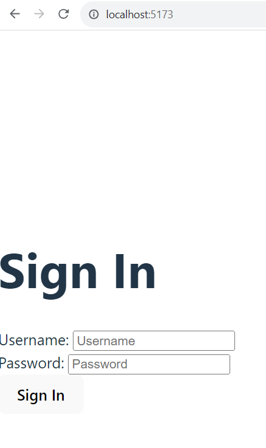

# React.js Exercise 1 – Getting Started

> Complete ALL the exercises in this section. Ask thomas.devine@atu.ie for help or post an *Issue* on your GitHub repository.


## Part 1 - Create & Run a React Application

Create your React application/project (``react-app``) by following the instructions outlined here in a Command Prompt window.  You can create this in your external hard drive.

```
$ npm create vite@4.1.0
Need to install the following packages:
create-vite@4.1.0
Ok to proceed? (y) y
...

Project name: react-app

Select a framework: » React

Select a variant: » TypeScript

```

Install/setup any project dependencies with these commands:

```
$ cd react-app
$ npm install
```

Run your react app with these commands:
```
$ cd react-app
$ npm run dev

VITE v4.4.11  ready in 666 ms
```

Open project web page: [ http://localhost:5173/]( http://localhost:5173/)

## Part 2 - Tour of Project Code

> Make sure you have the React app running as outlined.


1.	Using an editor open ``index.html``.  This is the default/starting web page for this project.

	```javascript
	...
	<body>
	  <div id="root"></div>
		...
	</body>
	</html>

	```

	Notice the ``<div>`` with an ``id="root"``.  This div is the placeholder for the React components.

1.	Using an editor open the ``App`` component in ``src/App.tsx``.  

	Notice the following:
	- the function ``App`` that returns the component HTML content
	- the ``export`` 
	
1.	Open ``src/main.tsx``.

	```javascript
	import React from 'react'
	import ReactDOM from 'react-dom/client'
	import App from './App'
	import './index.css'

	ReactDOM.createRoot(document.getElementById('root') as HTMLElement).render(
	<React.StrictMode>
	  <App />
	</React.StrictMode>,
	)
	```

	Notice:
	- the imports
	- the ``render()`` method that places the ``App`` component in the ``<div>`` in the ``index.html`` file


## Part 3 - My First React Component

1.	In the ``src`` folder create a new file ``HelloWorld.tsx`` and add our component code below:

	```javascript	
	function HelloWorld(){
	  return <h1>Hello React<h1/>;
	}

	export default HelloWorld;

	```

1.	Edit ``src/App.tsx``.  Ensure the code looks like this:

	```javascript
	import HelloWorld from "./HelloWorld";

	function App() {
	  return <div><HelloWorld /></div>;
	}

	export default App;


	```

1.	View your first component using the link [http://localhost:5173/](http://localhost:5173/)


## Part 4 - ``SignIn`` Component

Create a new component called ``SignIn`` and render it so it looks like this:




You must include the heading, labels, text boxes and button.  