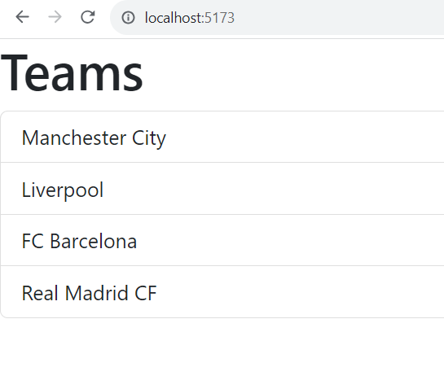
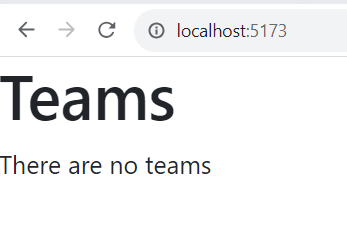
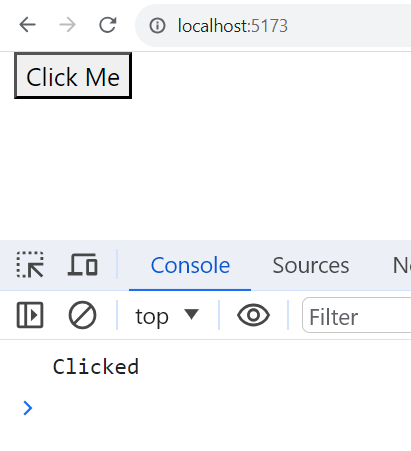
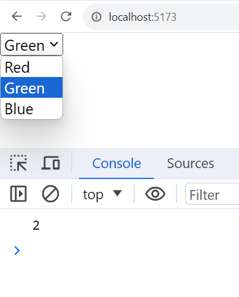
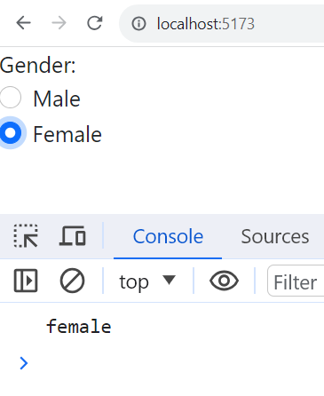

# React.js Exercise 2 – React Event Handling 

<!-- > Complete ALL the exercises in this section. Ask thomas.devine@atu.ie for help or post an *Issue* on your GitHub repository. -->
> Complete ALL the exercises in this section. Ask thomas.devine@atu.ie for help

<!-- # Fetch latest Repository Branch

```
$ cd /DRIVE/xampp/htdocs/d3
$ git pull --no-edit https://github.com/noucampdotorgRESTAPI2019/ReactJS.git latest
$ git status

``` -->


# Part 1 - ``Teams`` Component 



1.	Create and test the ``Teams`` component as shown in the slides/videos.

1.	Modify or add a team to the ``teams`` array to see the component update/react

1.	Remove all teams from the ``teams`` array.  You should update your component so the coponent renders the following:
	
	
	

# Part 2 - ``MyButton`` Component 



1.	Create and test the ``MyButton`` component as shown in the slides/videos.  Ensure you write an event handler to print a message to the console.
	
# Part 3 - ``Colours`` Component 



1.	Create and test the ``Colours`` component as shown in the slides/videos.  Make sure you print to the console the ``value`` of the colour selected.
	

# Part 4 - ``MyRadio`` Component 



1.	Create a new component ``MyRadio`` as shown above.  When a radio button is clicked display the correct value in the console.
